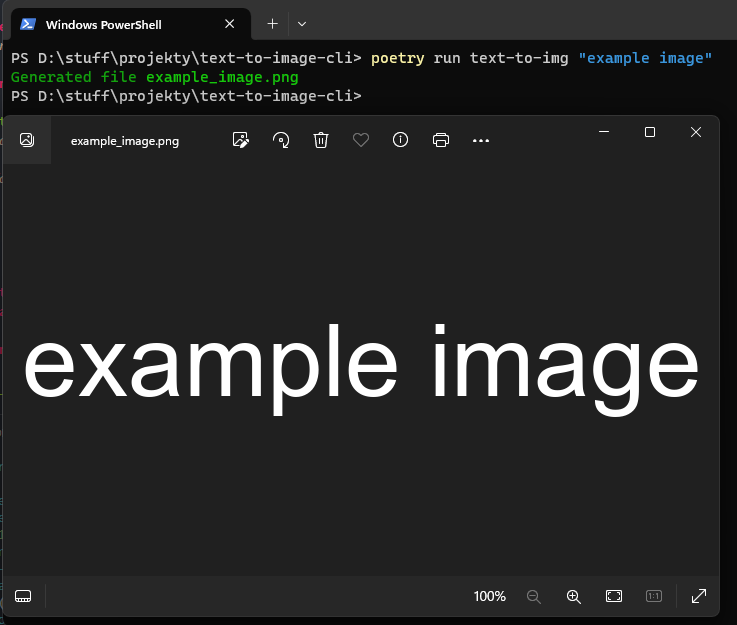
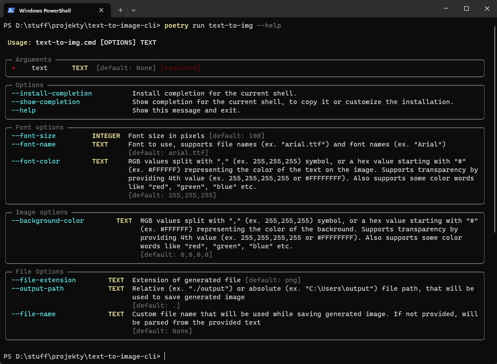

# Text-To-Img

TextToImg is a CLI app writen in Python 3 that generates images containing provided text based on provided parameters.

## Installation

1. Download and install [Python <=3.12](https://www.python.org/downloads/)

2. Install Poetry using `pip`

```bash
pip install poetry
```

3. Clone this repo to desired location

```bash
git clone https://github.com/sevnnn/Text-To-Img.git
cd Text-To-Img
```

4. Install required packages

```bash
poetry install --without=dev
```

<sup>You can also install it with development packages by removing `--without=dev` if your planning on modifying the code</sup>

## Usage

```bash
poetry run text-to-img --help
```

<details>

<summary>For developers</summary>

I have prepared two addicional Poetry scripts to help you modify my application:

### Code style && code cleanup

```bash
poetry run csfix
```

### Running tests

```bash
poetry run test
```

Note that you will need to have dev packages installed to not be greeted with an error upon running said scripts

</details>

## Example






